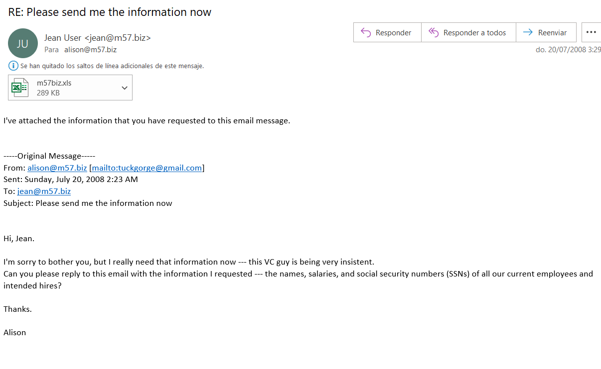
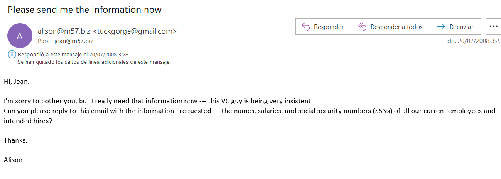
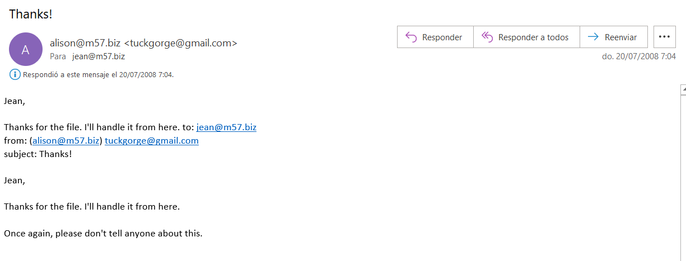
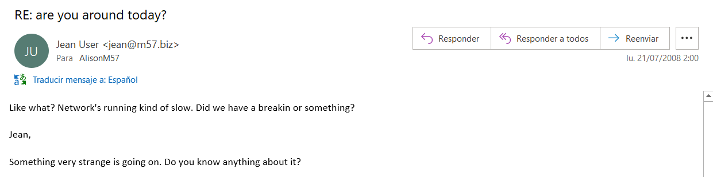

# NPS_EMAIL

## Abrimos Autopsy

```bash
sudo autopsy
```

## Como acceder a una imagen de un disco

1. Creamos un caso

2. Creamos un host para el caso

3. Una carpeta con los archivos .E01 relacionados con el caso

4. Analizamos la imagen con la extension correcta

5. Escogemos el C: y analizamos la imagen

## Analizar información del dispositivo de JEAN con Autopsy

Después de buscar hemos encontrado por donde se filtro en numero de la seguridad social

Fue filtrado por un excel


El cual JEAN envía a Alison



Debido que a que Alison lo pide con anterioridad



El problema es que el correo de Alison esta aletardo y redirige a tuckgorge@gmail.com

Aqui podemos ver como agradece que le haya envíado el excel al correo maliciosos:



Él momento que se dan cuenta de que algo va mal es en este correo:

